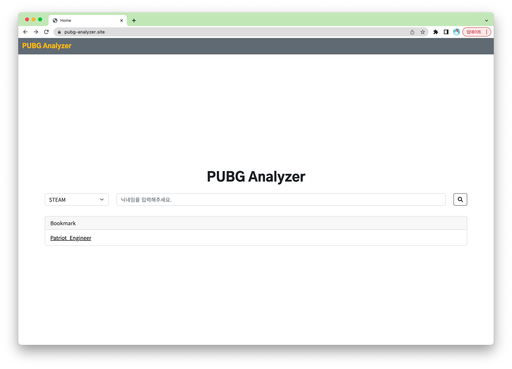
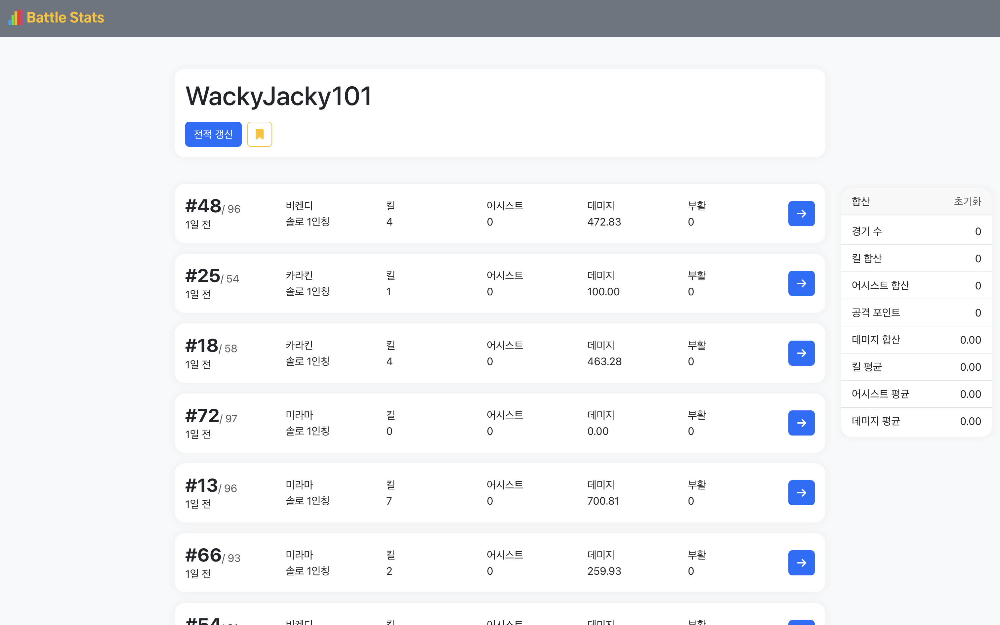
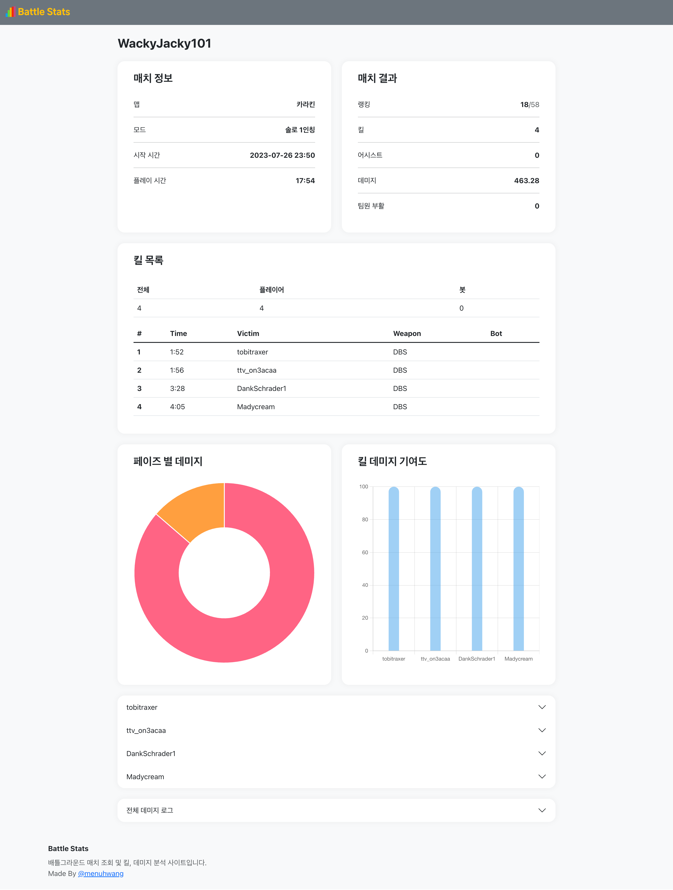
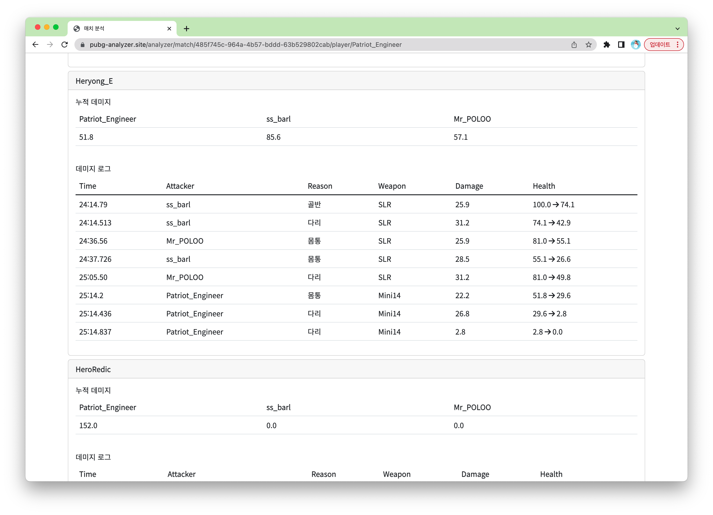
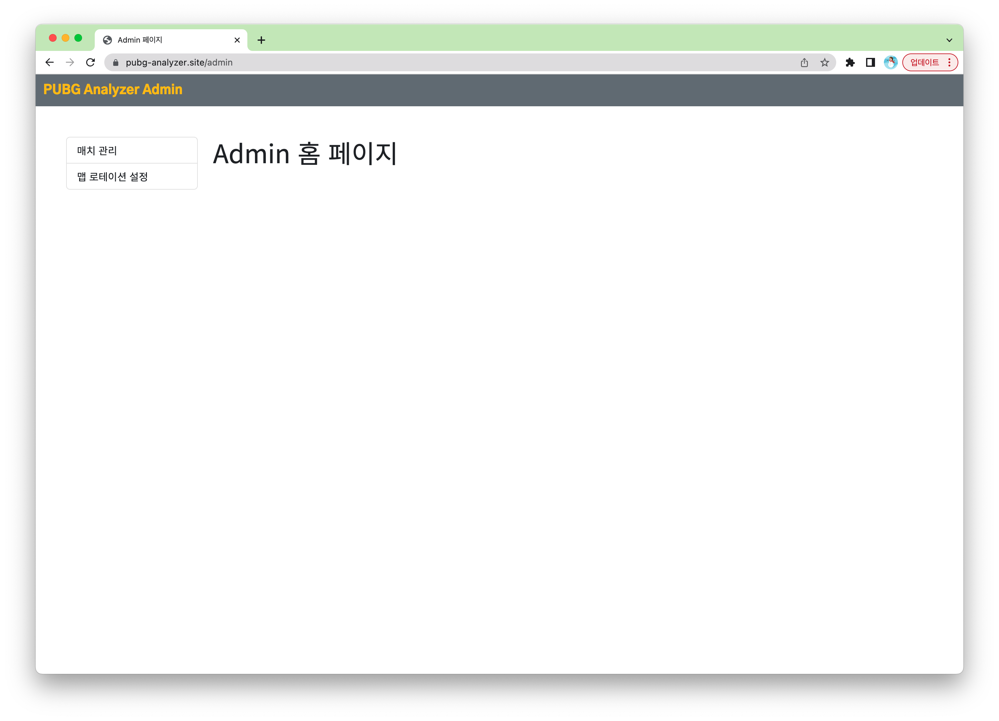

# PUBG Analyzer
   게임 배틀그라운드의 매치 로그를 분석해주는 서비스입니다.

# 🔗 Site
   - 홈페이지

# 📄 Page

## Home
   유저 검색 및 북마크 기능 제공
   
   - 다양한 Shard(스팀, 카카오, PS 등) 지원
   
## Match
   매치 조회, 매치 결과 계산 기능 제공
   ### 매치 조회
   
   - 매치 결과 맵, 등수, 킬, 데미지 등 요약 정보 조회
   
   ### 매치 결과 계산
   
   - 선택한 매치의 합산, 평균 결과 계산
   
## Analyze
   매치 결과 분석
   
   - 킬 정보 제공
   - 플레이어, 봇 구분
   
   ### 데미지 로그 분석
   
   - 팀원을 포함한 누적 데미지 제공
   - 데미지 이유, 데미지 부위, 데미지 제공

# 🔑 Admin
   서비스 관리를 위한 관리 페이지입니다.
   
   
## Manage Matches
   매치 조회, 매치 선택 삭제, 조건부 삭제 기능 제공
   .png)
   .png)
