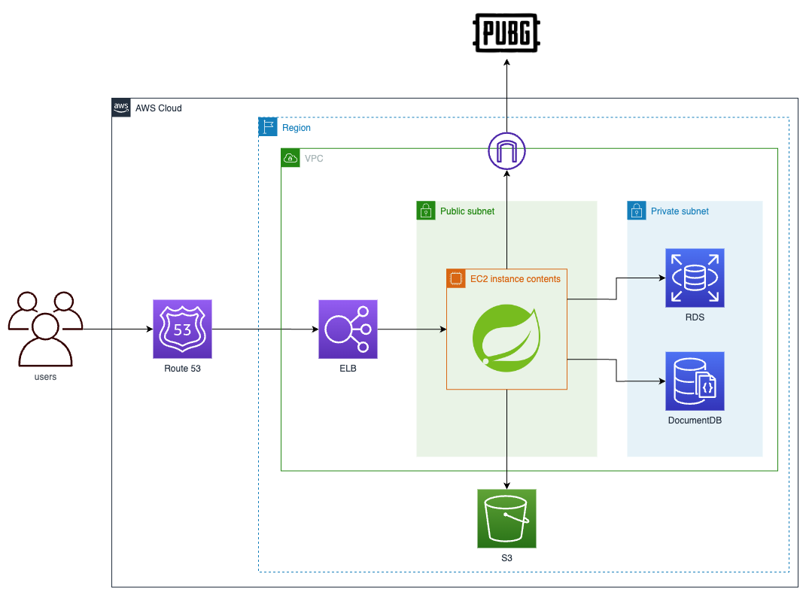
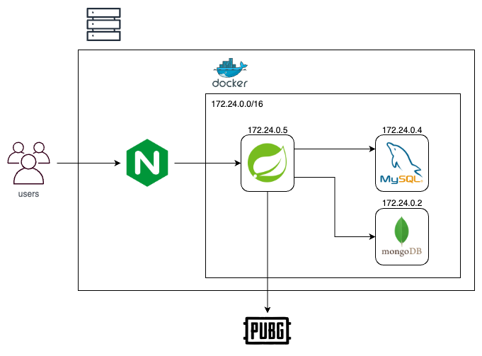

# PUBG Analyzer
   게임 배틀그라운드의 매치 로그를 분석해주는 서비스입니다.

# 🔗 Site
   - [API 명세서](https://docs.battlestats.site/swagger-ui/index.html?urls.primaryName=public)
   - [홈페이지](https://www.battlestats.site)
   - [Demo 플레이어 조회](https://www.battlestats.site/player/WackyJacky101)

# 🏢 Infra Architecture
### AWS

### On-premise 

# 🌁 View

## Home
   유저 검색 및 북마크 기능 제공
   
   
## Match
   매치 조회, 매치 결과 계산 기능 제공
   ### 매치 조회
   
   - 매치 결과 맵, 등수, 킬, 데미지 등 요약 정보 조회
   
## Analyze
   매치 결과 분석
   
   - 킬 정보 제공
   - 플레이어, 봇 구분

# Usage

## Page
   - [페이지 사용 팁](https://github.com/menuhwang/pubg-analyzer/wiki/Usage)